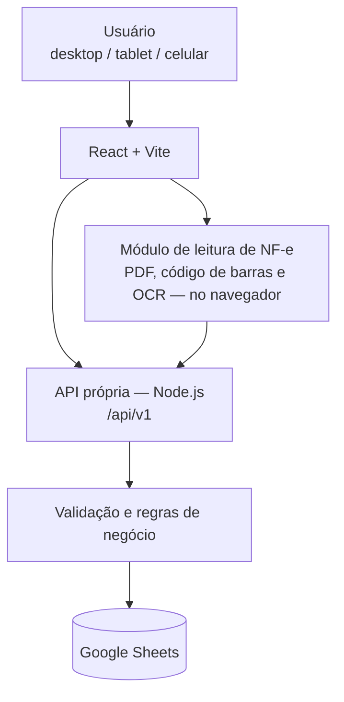

# ALM

## Sistema de Recebimentos de Almoxarifado


Aplicação web para gestão de recebimentos de materiais, acompanhamento operacional, persistência estruturada e leitura automática de NF-e.

### Equipe

Lucas Izaias
Marcelo Paidoz
Goran Henrique
Matteus Kobner

---

## Visão geral

Em um almoxarifado, o recebimento de materiais costuma passar por planilhas soltas, e-mails, grupos de WhatsApp, fotos avulsas e pastas de rede. Cada etapa do processo — o que chegou, quando chegou, se a nota fiscal acompanhou a entrega, se houve divergência — acaba registrada em um lugar diferente, sem uma trilha única que qualquer pessoa da equipe consiga seguir depois.

O ALM centraliza esse processo em uma única aplicação web, acessível por desktop, tablet ou celular, que guia o operador do primeiro registro até a finalização da conferência, mantém um histórico auditável de cada mudança e reduz digitação manual através da leitura automática da chave de acesso da Nota Fiscal eletrônica.

O sistema serve à equipe de Almoxarifado (quem recebe e confere o material no dia a dia), à Suprimentos (quem acompanha pendências e divergências) e à Administração (quem precisa de visibilidade sobre o processo como um todo).

---

## Funcionalidades

Levantadas diretamente do código atual em `main`:

- **Dashboard** com indicadores gerais, distribuição por status e itens que precisam de atenção.
- **Cadastro guiado de recebimento** em quatro etapas (Identificação, Itens, Evidências, Revisão).
- **Rascunhos** — um recebimento pode ser salvo incompleto ("Salvar e continuar depois") e retomado depois.
- **Envio para conferência**, com validação completa dos dados obrigatórios nesse momento.
- **Múltiplos itens** por recebimento, com alerta de divergência entre quantidade solicitada e recebida.
- **Evidências e anexos** — fotos do material e documentos (NF, DACTE, pedido de compra, certificados), com prévia de imagem.
- **Controle de status** com cinco estados, transições controladas por regra de negócio e por perfil de usuário.
- **Registro e resolução de divergências**, vinculadas ou não a um item específico.
- **Histórico de status e trilha de auditoria** por recebimento.
- **Busca, filtros, ordenação, paginação e exportação para CSV**.
- **Persistência via API própria**, com confirmação do backend antes de qualquer mensagem de sucesso.
- **Leitura automática de NF-e** — extração da chave de acesso a partir de PDF, imagem ou fotografia.
- **Painel de diagnóstico técnico** do leitor de NF-e, isolado da experiência normal do usuário.
- **Interface responsiva**, com componentes próprios para desktop e para celular/tablet.
- **Tema claro e escuro**, com alternância manual e persistência da preferência.

---

## Leitura automática de NF-e

Na tela `Leitura automática de NF-e`, existem hoje duas formas de trazer uma NF-e para o sistema:

- **Selecionar arquivo** — PDF do DANFE, ou uma imagem (JPG/PNG) já existente.
- **Fotografar código** — a aplicação abre a câmera do próprio aparelho e captura uma foto dedicada à leitura do código de barras.

O fluxo, confirmado diretamente no código (`src/features/nfeReader/`):

```text
Arquivo ou fotografia
        ↓
Análise (leitura da chave de acesso)
        ↓
Validação (dígito verificador)
        ↓
Revisão (campos editáveis, com selo de confiança)
        ↓
Confirmar dados
        ↓
Novo recebimento — pré-preenchido com os campos confiáveis
        ↓
Usuário complementa os campos restantes
        ↓
Salvar rascunho ou enviar para conferência
```

**Importante: a leitura da NF-e não salva um recebimento automaticamente.** "Confirmar dados" nunca chama a criação de um recebimento no backend — ele leva os dados extraídos até o formulário de "Novo recebimento", onde o usuário continua no controle: revisa, completa o que falta e decide quando salvar, exatamente como em qualquer outro cadastro.

### Quais campos são pré-preenchidos

Confirmado em `analysisBuilder.js` (`buildReliableReceiptPrefill`): só são levados automaticamente ao formulário os campos com correspondência confiável com a chave de acesso ou com o catálogo local de fornecedores:

| Campo | Como é obtido |
|---|---|
| Número da NF | Derivado matematicamente da chave de acesso |
| Série | Derivado matematicamente da chave de acesso |
| CNPJ do fornecedor | Derivado matematicamente da chave de acesso |
| Fornecedor | Só quando o CNPJ já está associado a um nome no catálogo local (preenchido manualmente em uma confirmação anterior) |

**Pedido de compra, data de emissão e valor total continuam manuais.** Quando aparecem na tela de revisão, vêm de heurísticas de texto sobre o PDF (regex sobre o texto extraído), nunca com confiança alta, e por isso nunca são levados automaticamente para o cadastro.

### Pipeline técnico

```text
PDF / Fotografia
        ↓
Texto embutido do PDF (quando disponível — se achar chave válida, para aqui)
        ↓
Imagem (canvas no navegador)
        ↓
ZBar (WebAssembly)
        ↓
ZXing (se o ZBar não encontrar)
        ↓
Pipeline robusto (recorte, contraste, margem artificial, correção de inclinação)
        ↓
OCR — Tesseract.js (último recurso, só se nenhum decoder de barras encontrar nada)
        ↓
Normalização da chave (remove tudo que não é dígito)
        ↓
Validação (dígito verificador, módulo 11)
        ↓
Campos derivados da chave
        ↓
Revisão
```

Cada etapa só é tentada se a anterior não resolveu — um PDF digital comum, com a chave já como texto selecionável, resolve na primeira etapa e nunca aciona os decodificadores de imagem nem o OCR.

### Tecnologias de leitura

| Tecnologia | Papel |
|---|---|
| **BarcodeDetector** | API nativa do navegador para leitura de código de barras, usada como atalho quando suportada (suporte não é universal). |
| **ZBar** (`@undecaf/zbar-wasm`) | Engine de leitura via WebAssembly — primeira tentativa em fotografias estáticas. |
| **ZXing** (`@zxing/browser`/`@zxing/library`) | Biblioteca de leitura de código de barras, usada como reforço e no pipeline robusto. |
| **Tesseract.js** | OCR — reconhecimento óptico de caracteres, último recurso. |

A diferença importa: um **decodificador de código de barras** (BarcodeDetector, ZXing, ZBar) lê o padrão de barras; **OCR** lê os números impressos por extenso. São mecanismos diferentes, não intercambiáveis.

### Por que fotografia, e não scanner contínuo

Em teste físico real, a captura por fotografia se mostrou confiável de ponta a ponta, enquanto a leitura contínua pela câmera (quadro a quadro, em tempo real) não se mostrou consistente em todos os aparelhos testados. Por isso, a interface de produção oferece a fotografia como ação principal de leitura de código de barras: ela entrega uma imagem estática de maior qualidade, permite processamento mais robusto sobre uma imagem parada, reduz a dependência de APIs de câmera específicas de cada navegador e funciona bem em dispositivos móveis.

O scanner de leitura contínua (`NfeLiveScanner.jsx`) continua implementado e funcionando no código — ele é mantido para diagnóstico e desenvolvimento (ver [Painel de diagnóstico](#painel-de-diagnóstico-de-nf-e)), mas não é a ação principal oferecida na interface de produção.

### Validação da chave de acesso

Encontrar 44 dígitos não é suficiente para aceitar uma sequência como chave de NF-e. Em qualquer fonte — texto do PDF, código de barras ou OCR — a chave passa por: normalização (remove tudo que não é dígito) → confirmação de que restam 44 dígitos → recálculo do dígito verificador (módulo 11) → só então é aceita. Essa validação é centralizada em um único ponto do código (`chaveNFe.js`) e reaproveitada por todas as fontes, reduzindo a chance de um código de barras de outro produto ou um texto qualquer ser aceito como se fosse a chave da nota.

---

## Arquitetura



Em texto: o frontend fala apenas com a API própria; a API valida os dados, controla permissões por perfil e só então grava no Google Sheets. **O frontend nunca acessa a planilha diretamente.** O módulo de leitura de NF-e roda inteiramente no navegador e só entrega ao restante da aplicação um conjunto de campos já validados, que seguem o mesmo caminho de qualquer outro dado digitado manualmente.

### Frontend

- **React 18** para componentização e estado de tela.
- **Vite 6** como build tool e servidor de dev, com carregamento sob demanda (`React.lazy`) para o módulo de NF-e e suas dependências mais pesadas.
- Layout responsivo, com componentes próprios para desktop (barra lateral) e para mobile (navegação inferior, cartões no lugar de tabela).
- Tema claro/escuro com alternância manual e preferência salva.

### Backend

Servidor HTTP em **Node.js**, sem framework adicional, expondo uma API REST em `/api/v1`. Responsável por:

- Validar os dados antes de gravar (campos obrigatórios, formato de data, CNPJ, quantidades), retornando o detalhe de qual campo falhou.
- Aceitar rascunhos incompletos, mas exigir dados completos no envio para conferência.
- Controlar permissões por perfil de usuário nas transições de status.
- Registrar histórico de status e trilha de auditoria por recebimento.
- Persistir anexos (bytes em `backend/uploads/`, metadados na planilha).

No ambiente de desenvolvimento, a identidade é simulada por um cabeçalho HTTP (`X-User-Id`), alternando entre usuários de demonstração — isso não substitui um login corporativo real; é o mecanismo usado para exercitar as regras de permissão por perfil.

### Google Sheets

Cada entidade do domínio (recebimentos, itens, divergências, histórico de status, auditoria, anexos, usuários) tem sua própria aba na planilha, criada automaticamente se ainda não existir. A comunicação com o Google Sheets fica isolada em uma única camada (`backend/integrations/googleSheets.mjs`) — o restante da API só conhece um repositório de dados, não a planilha em si. Isso permite trocar a persistência no futuro (por exemplo, para um banco relacional) alterando apenas essa camada, sem mudar o frontend nem os contratos HTTP.

### Persistência confiável

A interface aguarda a confirmação real do backend antes de mostrar qualquer mensagem de sucesso. Criar um recebimento ou mudar seu status só é considerado concluído depois que a API confirma a gravação; se a chamada falhar, o registro criado de forma otimista na tela é desfeito, e o usuário vê uma mensagem de erro específica. Isso evita mostrar sucesso quando o dado não foi realmente persistido e evita registros fantasmas — que existem na tela, mas não na fonte de dados real.

---

## Tecnologias

| Tecnologia | Papel |
|---|---|
| React 18 | Interface do frontend |
| Vite 6 | Build e servidor de desenvolvimento |
| lucide-react | Ícones da interface |
| pdfjs-dist | Leitura de PDF no navegador (extração de texto e renderização) |
| @zxing/browser / @zxing/library | Leitura de código de barras |
| @undecaf/zbar-wasm | Leitura de código de barras via WebAssembly |
| tesseract.js | OCR — fallback de leitura da chave de NF-e |
| Node.js (HTTP nativo) | Servidor da API própria |
| googleapis | Cliente oficial do Google, usado para o Google Sheets |
| dotenv | Carregamento de variáveis de ambiente no backend |

---

## Estrutura do projeto

```text
src/
  App.jsx              # telas, navegação, formulários
  data.js               # modelo de domínio, status, regras auxiliares
  store.js               # estado da aplicação e sincronização com a API
  api.js                  # cliente HTTP do frontend
  ui.jsx                   # componentes visuais reutilizáveis
  layout/                   # navegação (rotas por hash), sidebar, mobile nav
  features/nfeReader/        # módulo de leitura automática de NF-e (isolado)
backend/
  server.mjs             # ponto de entrada da API
  config/                 # leitura de variáveis de ambiente
  services/                # regras de negócio
  repositories/             # acesso a dados (Google Sheets)
  integrations/              # integração com a API do Google
  uploads/                    # bytes dos anexos enviados
docs/                # documentação de apresentação do projeto
public/               # assets estáticos (inclui recursos de pdf.js/tesseract copiados no install)
```

---

## Executando localmente

Pré-requisito: Node.js 18 ou superior.

```bash
git clone <url-do-repositório>
cd ALLM
npm install
npm run dev
```

`npm install` também roda `postinstall` (`scripts/copy-vendor-assets.mjs`), que copia os recursos de `pdfjs-dist` necessários para o módulo de leitura de NF-e funcionar corretamente.

A aplicação abre em `http://localhost:5173/` (ou outra porta, se essa estiver ocupada — use sempre a URL exibida no terminal).

### Backend (API + Google Sheets)

Em outro terminal:

```bash
npm run api
```

O frontend (`src/api.js`, `src/store.js`) opera em modo API-first: o estado inicial é carregado do servidor e as mutações são sincronizadas por chamada. Se a API estiver indisponível na carga inicial, o fallback é uma lista vazia — nunca dados de demonstração.

### Build de produção

```bash
npm run build      # gera a pasta dist/
npm run preview    # serve a build de produção localmente, para testes
```

---

## Configuração

Crie `backend/.env` a partir de `.env.example` (raiz do projeto). Variáveis usadas pelo backend, confirmadas em `backend/config/env.mjs` — **apenas os nomes**, nunca valores reais devem ser versionados:

```env
# Frontend — URL da API
VITE_API_URL=

# Backend — credenciais da conta de serviço do Google (obrigatórias)
GOOGLE_SHEETS_SPREADSHEET_ID=
GOOGLE_SERVICE_ACCOUNT_EMAIL=
GOOGLE_PRIVATE_KEY=

# Backend — opcionais (têm valor padrão se ausentes)
PORT=
HOST=
CORS_ORIGIN=
ALM_UPLOAD_DIR=
```

`GOOGLE_SHEETS_SPREADSHEET_ID`, `GOOGLE_SERVICE_ACCOUNT_EMAIL` e `GOOGLE_PRIVATE_KEY` são obrigatórias — o backend não inicia sem elas. Nunca use o prefixo `VITE_` nessas variáveis (isso as exporia ao bundle do frontend), e nunca versione o `.env` nem um `credentials.json` da conta de serviço.

### Configurando o Google Sheets (alto nível)

1. Crie uma conta de serviço no Google Cloud e gere uma chave.
2. Compartilhe a planilha de destino com o e-mail dessa conta de serviço, com permissão de edição.
3. Preencha `GOOGLE_SHEETS_SPREADSHEET_ID`, `GOOGLE_SERVICE_ACCOUNT_EMAIL` e `GOOGLE_PRIVATE_KEY` no `backend/.env`.
4. As abas necessárias (`Recebimentos`, `Itens`, `Divergencias`, `HistoricoStatus`, `Auditoria`, `Anexos`, `Usuarios`) são criadas automaticamente na primeira execução, se ainda não existirem.

---

## Scripts

| Script | Descrição |
|---|---|
| `npm run dev` | Sobe o servidor de desenvolvimento do frontend (Vite) |
| `npm test` | Roda a suíte de testes (`node --test`) da lógica de NF-e |
| `npm run build` | Gera a build de produção em `dist/` |
| `npm run preview` | Serve a build de produção localmente |
| `npm run api` | Sobe o servidor da API (backend) |
| `npm run api:dev` | Sobe a API com reinício automático (`node --watch`) |

---

## Testes

Resultado obtido executando a suíte no momento deste documento:

```text
$ npm test
ℹ tests 56
ℹ pass 56
ℹ fail 0

$ npm run build
✓ built em ~6s, sem erros
```

Cobertura por área, sem depender de câmera, navegador completo ou rede:

- **Validação de NF-e** — cálculo do dígito verificador (módulo 11) da chave de acesso.
- **Decoders** — classificação de cada tentativa de leitura de código de barras e os adaptadores usados no painel de diagnóstico.
- **Captura** — cálculo do teto de redução de fotos grandes e feature detection de `ImageCapture`.
- **Handoff / pré-preenchimento** — montagem do resultado de análise e a regra de que só campos de alta confiança chegam ao formulário de recebimento.

Fluxos que dependem de APIs de navegador reais (câmera, Canvas, renderização de PDF, navegação entre telas) são validados por scripts Playwright dedicados, documentados em [`src/features/nfeReader/testFixtures/README.md`](src/features/nfeReader/testFixtures/README.md).

---

## Deploy

O projeto é construído com Vite (`npm run build`), gerando arquivos estáticos em `dist/`. Existe uma versão publicada, hospedada na Vercel, usada para validação funcional e testes em dispositivo físico. O backend (API própria + integração com Google Sheets) roda como um processo Node.js separado do frontend estático.

---

## Painel de diagnóstico de NF-e

Existe um modo de diagnóstico técnico do leitor de NF-e, ativado por uma query string (`?nfeScannerDebug=1`) na URL da tela de leitura automática. Sem essa flag, nenhum botão ou link extra aparece, e nenhum código relacionado ao painel é baixado pelo navegador.

O painel compara, sobre a mesma imagem ou frame de câmera, a disponibilidade e o resultado de cada engine de leitura (BarcodeDetector, ZXing, ZBar), tempo de decodificação e resolução usada — nunca expõe uma chave de NF-e completa, CNPJ, fornecedor ou qualquer outro dado fiscal. Detalhes completos: [`src/features/nfeReader/README.md`](src/features/nfeReader/README.md#benchmark-de-decoders-diagnóstico).

---

## Privacidade

A leitura de PDF, a decodificação de código de barras (BarcodeDetector, ZXing, ZBar) e o OCR (Tesseract.js) rodam inteiramente no navegador do usuário — nenhum frame de vídeo ou fotografia é enviado a um servidor como parte do processo de **leitura** da NF-e.

Isso é diferente da **persistência do recebimento**: depois que o usuário revisa e confirma os dados (extraídos ou digitados manualmente), essas informações são enviadas para a API própria e gravadas no Google Sheets — como em qualquer sistema de cadastro. A autenticação atual (cabeçalho `X-User-Id`) é um mecanismo de demonstração, não um login corporativo real; as credenciais da integração com o Google ficam apenas em variáveis de ambiente do backend, nunca em código versionado ou expostas ao frontend.

---

## Decisões de engenharia

- **Feature detection, nunca identificação de navegador/aparelho** — a aplicação verifica se uma API existe e funciona, nunca tenta adivinhar o dispositivo.
- **Fallbacks sequenciais** na leitura de código de barras, nunca em paralelo (evita gastar CPU/bateria decodificando o mesmo frame duas vezes).
- **Captura de foto com fallback automático** — tenta a API de maior qualidade primeiro, cai para o seletor de câmera nativo se ela não existir ou falhar.
- **Validação da chave centralizada** em um único ponto do código, reaproveitada por todas as fontes de leitura.
- **Backend intermediando o Google Sheets** — o frontend nunca escreve diretamente na planilha.
- **Confirmação real de persistência** antes de qualquer mensagem de sucesso na interface.
- **Carregamento sob demanda (`lazy loading`)** do módulo de NF-e e do painel de diagnóstico, para não pesar o carregamento inicial da aplicação.

### Evolução do scanner

Caso a operação venha a exigir, no futuro, leitura contínua de código de barras em nível industrial (por exemplo, esteira de alto volume), SDKs comerciais especializados como Dynamsoft Barcode Reader ou Scandit Barcode Scanner SDK podem ser considerados. Essa avaliação não faz parte do escopo atual do projeto.

---

## Escopo atual e evolução

O projeto está em desenvolvimento ativo e possui uma versão publicada, usada para validação funcional. Alguns caminhos naturais de continuidade:

- Persistência em banco de dados relacional, caso o volume de dados venha a justificar a migração.
- Autenticação corporativa real, no lugar do mecanismo de usuário de demonstração atual.
- Novas integrações (por exemplo, consulta a um ERP para validar o pedido de compra).
- Novos indicadores no dashboard, conforme o uso real apontar o que é mais relevante.
- Scanner de código de barras de nível industrial, se a operação exigir (ver [Evolução do scanner](#evolução-do-scanner)).

---

## Documentação

- [`src/features/nfeReader/README.md`](src/features/nfeReader/README.md) — documentação técnica completa do módulo de leitura de NF-e.
- [`docs/ALM_Apresentacao_Projeto.md`](docs/ALM_Apresentacao_Projeto.md) — apresentação estendida do projeto.
- [`docs/ALM_Apresentacao_Projeto.html`](docs/ALM_Apresentacao_Projeto.html) — versão HTML autocontida do documento acima.
- [`docs/ALM_Apresentacao_Executiva.html`](docs/ALM_Apresentacao_Executiva.html) — apresentação executiva (HTML autocontido).

---

## Licença

Este projeto não possui, até o momento, uma licença de código aberto definida.
