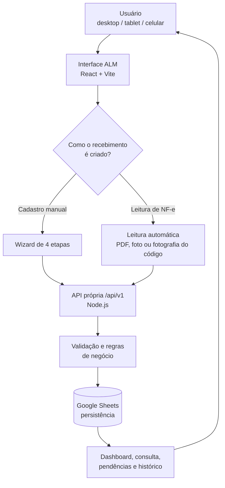

# ALM
## Sistema de Recebimentos de Almoxarifado

**Gestão de recebimentos, leitura automática de NF-e e integração de dados**

*Documento de apresentação do projeto — versão para banca, avaliadores e gestores*

---

## 1. Introdução

Em um almoxarifado, o recebimento de materiais costuma passar por planilhas soltas, e-mails, grupos de WhatsApp, fotos avulsas e pastas de rede. Cada etapa do processo — o que chegou, quando chegou, se a nota fiscal acompanhou a entrega, se houve alguma divergência — fica registrada em um lugar diferente, sem uma trilha única que qualquer pessoa da equipe consiga seguir depois.

O ALM existe para resolver exatamente esse problema: ele centraliza o recebimento de materiais em uma única aplicação web, acessível por desktop, tablet ou celular, que guia o operador do primeiro registro até a finalização da conferência, mantém um histórico auditável de cada mudança e reduz a necessidade de digitação manual através da leitura automática da chave de acesso da Nota Fiscal eletrônica.

O sistema serve à equipe de Almoxarifado (quem recebe e confere o material no dia a dia), à Suprimentos (quem acompanha pendências e divergências) e à Administração (quem precisa de visibilidade sobre o processo como um todo). Centralizar essas informações não é só uma questão de organização: é o que permite que qualquer pessoa da equipe — não só quem lançou o registro — consiga entender o estado de um recebimento, retomar o que ficou pendente e confiar que o que está na tela reflete o que realmente foi persistido.

---

## 2. Visão geral do projeto

Em alto nível, o ALM é uma aplicação React que fala com uma API própria em Node.js, que por sua vez persiste os dados em uma planilha do Google Sheets através da API oficial do Google.

```
Usuário (desktop, tablet ou celular)
        │
        ▼
Interface ALM (React + Vite)
        │
        ├── Cadastro de recebimento (wizard de 4 etapas)
        ├── Leitura automática de NF-e (opcional, roda no navegador)
        ├── Consulta, filtros e exportação
        └── Acompanhamento de status e divergências
        │
        ▼
API própria (Node.js, HTTP puro, REST em /api/v1)
        │
        ├── Validação de regras de negócio
        ├── Controle de permissões por perfil
        └── Registro de auditoria e histórico de status
        │
        ▼
Google Sheets (persistência dos dados estruturados)
        │
        ▼
Acompanhamento do processo (dashboard, pendências, histórico)
```

Diagrama equivalente, em Mermaid (para quem visualizar este documento em uma ferramenta que renderiza Mermaid):



O ponto central da arquitetura é que **a interface nunca fala diretamente com o Google Sheets**: toda escrita passa pela API própria, que valida, controla permissões por perfil de usuário e registra quem fez o quê. Isso mantém a planilha como um destino de persistência substituível — o próprio README do projeto documenta essa decisão: trocar Google Sheets por um banco de dados relacional no futuro exigiria alterar apenas a camada de integração (`backend/integrations/googleSheets.mjs`), não o restante do sistema.

---

## 3. Principais funcionalidades

Levantadas diretamente do código atual em produção (`main`):

- **Dashboard** com indicadores gerais (total de recebimentos, materiais recebidos hoje, documentações pendentes, divergências abertas), distribuição por status e lista de itens que precisam de atenção.
- **Cadastro guiado de recebimento** em quatro etapas (Identificação, Itens, Evidências, Revisão), com validação por etapa.
- **Rascunhos**: um recebimento pode ser salvo incompleto ("Salvar e continuar depois") e retomado mais tarde, sem perder o que já foi digitado.
- **Envio para o fluxo de conferência**, com validação completa dos dados obrigatórios nesse momento.
- **Múltiplos itens** por recebimento, com quantidade solicitada x recebida e alerta de divergência de quantidade.
- **Upload de evidências**: fotos do material e documentos (Nota Fiscal, DACTE, Pedido de Compra, certificados e outros), com prévia de imagem.
- **Controle de status** com cinco estados (Em digitação, Aguardando documentação, Em conferência, Divergência identificada, Conferido/Finalizado), transições controladas por regras de negócio e por perfil de usuário.
- **Registro e resolução de divergências**, vinculadas ou não a um item específico.
- **Histórico de status e trilha de auditoria** por recebimento (quem alterou o quê e quando).
- **Consulta com busca, filtros, ordenação, paginação e exportação para CSV** compatível com Excel.
- **Persistência real através de uma API própria**, com confirmação do backend antes de mostrar sucesso ao usuário.
- **Integração com Google Sheets** como armazenamento estruturado dos dados.
- **Leitura automática de NF-e**: extração da chave de acesso e dos campos derivados dela a partir de PDF, imagem selecionada ou fotografia tirada pela própria aplicação.
- **Painel de diagnóstico técnico** do leitor de NF-e, isolado da experiência normal do usuário.
- **Interface responsiva**, com componentes próprios para desktop e para celular/tablet.
- **Tema claro e escuro**, com alternância manual e persistência da preferência do usuário.
- **Testes automatizados** para a lógica de validação e leitura de NF-e (51 testes passando no momento deste documento).

---

## 4. Fluxo de recebimento

Quando alguém cria um recebimento, o processo segue este caminho:

1. **Identificação** — pedido de compra, fornecedor, data, CNPJ (opcional, mas validado quando informado) e tipo de recebimento.
2. **Itens** — um ou mais materiais, cada um com descrição, quantidade solicitada, quantidade recebida e unidade. Se a quantidade recebida diferir da solicitada, o sistema já sinaliza isso na tela.
3. **Evidências** — fotos do material e documentos (a Nota Fiscal pode ficar pendente nesta etapa; o sistema deixa isso explícito e não bloqueia o cadastro por causa disso).
4. **Revisão** — um resumo de tudo o que foi preenchido, com atalhos para editar qualquer etapa anterior antes de confirmar.

A partir daqui existem dois caminhos:

- **"Salvar e continuar depois"** grava o recebimento como **rascunho**. O backend aceita esse registro mesmo com campos como pedido, fornecedor ou descrição dos itens ainda incompletos — a validação completa só é exigida quando o recebimento é efetivamente enviado ao fluxo.
- **"Enviar para conferência"** exige que os dados obrigatórios estejam completos (validados tanto na interface quanto no backend) e move o recebimento para o status **Aguardando documentação** (se a NF ainda não tiver sido anexada) ou **Em conferência** (se já tiver).

Um ponto de confiabilidade importante, implementado na camada de estado da aplicação (`store.js`): a interface **aguarda a confirmação real do backend** antes de mostrar a mensagem de sucesso. Criar um recebimento ou mudar seu status só é considerado concluído depois que a API confirma que a gravação na planilha aconteceu; se a chamada falhar, o registro criado de forma otimista na tela é desfeito (ou o erro é propagado para quem chamou), e o usuário vê uma mensagem de erro específica em vez de um "sucesso" falso.

Isso importa por três razões concretas:

- **Evita mostrar sucesso quando o registro não foi realmente persistido** — sem essa espera, seria possível a tela dizer "recebimento criado" e a planilha nunca ter recebido a linha correspondente.
- **Evita registros fantasmas** — um recebimento que existe na tela do usuário, mas não existe na fonte de dados real, é pior do que nenhum recebimento: ele passa confiança falsa.
- **Melhora a confiabilidade geral do processo** — em um sistema que substitui controle manual, a garantia de que "o que está na tela é o que está gravado" é o requisito mínimo para a equipe confiar na ferramenta.

---

## 5. Leitura automática de NF-e

Esta é uma das partes mais elaboradas do projeto — não é uma biblioteca de scanner simplesmente conectada à tela, é um **pipeline completo de aquisição, leitura, validação e diagnóstico**, construído em várias rodadas de investigação e teste real.

Hoje, na interface de produção, existem duas formas de trazer uma NF-e para o sistema:

- **Selecionar arquivo** — PDF do DANFE, ou uma imagem (JPG/PNG) já existente.
- **Fotografar código** — a aplicação abre a câmera do próprio aparelho e captura uma foto dedicada à leitura do código de barras, com a melhor qualidade que o navegador permitir.

> O scanner de leitura contínua pela câmera (que tenta decodificar o código de barras em tempo real, quadro a quadro) foi implementado e continua funcionando internamente, mas **não é apresentado como ação principal na interface de produção**. Em teste físico real (iPhone), a captura por fotografia se mostrou confiável, enquanto a leitura contínua não — por isso a decisão consciente de priorizar "Fotografar código" e manter o scanner ao vivo disponível apenas para desenvolvimento e diagnóstico (seção 10).

O caminho que uma imagem percorre, do arquivo/fotografia até os dados preenchidos na tela, confirmado diretamente no código-fonte (`src/features/nfeReader/`):

```
Arquivo (PDF/foto) ou fotografia dedicada
        │
        ▼
PDF? → tenta extrair o texto embutido primeiro
        │ (se achar uma chave de 44 dígitos válida no texto, para aqui)
        ▼
Imagem (canvas no navegador)
        │
        ▼
Leitura de código de barras — ordem de tentativa:
   1) ZBar (WebAssembly)
   2) ZXing, se o ZBar não encontrar
   3) Pipeline robusto (recorte, contraste, margem artificial,
      correção de pequena inclinação), se os dois anteriores falharem
        │
        ▼
OCR (Tesseract.js), somente se nenhum decoder de barras encontrar nada
        │
        ▼
Normalização da chave (remove tudo que não é dígito)
        │
        ▼
Validação da chave de NF-e (dígito verificador, módulo 11)
        │
        ▼
Extração dos campos possíveis a partir da chave
(UF, ano/mês, CNPJ do emitente, série, número da NF)
        │
        ▼
Tela de revisão — usuário confirma ou corrige manualmente
```

Cada etapa só é tentada se a anterior não resolveu — um PDF digital comum, que já tem a chave como texto selecionável, resolve na primeira etapa e nunca aciona os decodificadores de imagem nem o OCR. Isso mantém o caso comum rápido e reserva o processamento mais pesado para os casos que realmente precisam dele.

**Nenhuma chave é aceita só por "parecer" uma chave de NF-e.** Em qualquer uma das fontes — texto do PDF, código de barras ou OCR — a sequência de 44 dígitos passa pelo mesmo cálculo de dígito verificador antes de ser considerada válida. Um código de barras de outro produto, uma etiqueta de transportadora ou um texto qualquer com 44 números não é aceito como se fosse a chave da nota.

---

## 6. Tecnologias utilizadas na leitura de códigos

O módulo de NF-e usa quatro tecnologias diferentes, cada uma com um papel específico — elas não fazem a mesma coisa, e a arquitetura foi desenhada em torno dessa diferença.

| Tecnologia | O que é | Papel no ALM |
|---|---|---|
| **BarcodeDetector** | API nativa do navegador para leitura de código de barras. | Usada como atalho rápido quando o navegador suporta (principalmente Chromium/Android). O suporte **não é universal** — Safari/iOS historicamente não implementa essa API — por isso o sistema nunca depende exclusivamente dela. |
| **ZXing** (`@zxing/browser`/`@zxing/library`) | Biblioteca open source de leitura de códigos de barras, em JavaScript. | Mecanismo de leitura adicional/fallback, usado tanto no fast path (uma tentativa rápida) quanto no pipeline robusto (com recorte, rotação e correção de inclinação). |
| **ZBar** (`@undecaf/zbar-wasm`) | Engine de leitura de código de barras compilada para WebAssembly. | Primeira tentativa no processamento estático de uma fotografia — no conjunto de fixtures sintéticas usado para testar o projeto, o ZBar decodificou corretamente 10 de 10 casos, contra 7 de 10 do ZXing sozinho, incluindo casos com rotação e pequena inclinação. É especialmente relevante justamente para fotos estáticas, onde ele já demonstrou boa tolerância a imperfeições de enquadramento. |
| **Tesseract.js (OCR)** | Motor de reconhecimento óptico de caracteres. | Último recurso, só acionado se nenhum dos três decodificadores de barras encontrar nada. |

A diferença conceitual entre as duas categorias é importante e costuma gerar confusão:

- **Decodificador de código de barras** (BarcodeDetector, ZXing, ZBar) **lê as barras** — o padrão de linhas pretas e brancas impresso no código.
- **OCR** **lê caracteres visíveis** — os 44 números impressos por extenso, normalmente logo abaixo do código de barras.

Uma foto que mostre só as barras, sem os números escritos, pode falhar no OCR mesmo que o código de barras esteja perfeito — e o sistema informa isso ao usuário de forma específica, em vez de uma mensagem genérica de "não foi possível ler".

---

## 7. Por que esta solução é boa

Vale destacar o que foi de fato construído, porque não é apenas "uma biblioteca de scanner adicionada à tela":

- **Processamento local, no navegador.** A decodificação de código de barras e o OCR rodam inteiramente no dispositivo do usuário (Canvas, WebAssembly, APIs de câmera) — não é necessário enviar a imagem para um servidor para tentar ler o código.
- **Baixo custo de dependência comercial.** As quatro tecnologias de leitura usadas (BarcodeDetector, ZXing, ZBar, Tesseract) são gratuitas e de código aberto; nenhuma licença comercial de scanner foi necessária até este ponto do projeto.
- **Múltiplos mecanismos de fallback, em vez de um único ponto de falha.** Se um decodificador não encontra a chave, o próximo assume — sequencialmente, nunca ao mesmo tempo (evita desperdiçar CPU/bateria decodificando o mesmo frame duas vezes em paralelo).
- **Validação própria da chave de NF-e**, centralizada em um único lugar (`chaveNFe.js`) e reaproveitada por todas as fontes (texto, código de barras, OCR) — o critério do que conta como "chave válida" nunca diverge entre um caminho e outro.
- **Capacidade de diagnóstico real.** Existe uma ferramenta dedicada (seção 10) para comparar os engines de leitura lado a lado, medir tempo de decodificação e investigar problemas — sem depender de suposição.
- **Baixo acoplamento a um fornecedor comercial específico.** Trocar, adicionar ou remover um engine de leitura é uma decisão de engenharia interna, não uma negociação de contrato.
- **Funciona em dispositivos móveis reais**, incluindo iPhone/Safari, onde nem toda API de câmera de última geração está disponível — a estratégia de captura foi desenhada e testada fisicamente para esse cenário.
- **Integração natural com o restante do ALM** — a chave lida alimenta os mesmos campos (número da NF, série, CNPJ, fornecedor) usados no cadastro manual, sem um fluxo paralelo.
- **Capacidade de evolução.** A arquitetura em camadas (decodificadores isolados, pipeline de estágios, benchmark separado) permite adicionar um novo engine, ajustar a ordem de tentativas ou até considerar um SDK comercial no futuro sem reescrever o módulo inteiro.

---

## 8. Decisões de engenharia

Algumas decisões técnicas não são óbvias à primeira vista, mas explicam por que o sistema funciona do jeito que funciona:

- **Feature detection, nunca identificação de aparelho por user-agent.** A aplicação nunca pergunta "isso é um iPhone?" ou "isso é Android?" — ela pergunta diretamente "esta API existe e funciona neste navegador?" (`BarcodeDetector` disponível? `ImageCapture` disponível?). Isso evita que a lógica quebre quando um navegador novo aparece ou quando um navegador existente muda de comportamento.
- **`ImageCapture` quando disponível, com fallback automático.** A captura de foto tenta primeiro a API `ImageCapture`, que costuma entregar uma imagem de qualidade mais alta que o vídeo ao vivo. Se essa API não existir, ou se falhar na hora de tirar a foto (comportamento observado como inconsistente entre aparelhos mesmo quando a API existe), o sistema cai automaticamente para o seletor de câmera nativo do sistema operacional — sem travar a tela.
- **Limite de resolução por segurança de memória, não por economia.** Fotos de celular modernas podem chegar a dezenas de megapixels; o sistema só reduz a imagem se ela ultrapassar um teto de segurança (4096 pixels no maior lado) — para não arriscar travar o navegador com uma imagem gigantesca — mas nunca reduz cegamente para uma resolução baixa fixa.
- **ZBar antes de ZXing na leitura estática**, com base em evidência medida (seção 6), não em suposição.
- **A validação da chave acontece depois — e só uma vez.** Nenhum decodificador implementa sua própria checagem de "isso é uma NF-e válida"; a validação (dígito verificador) é centralizada e idêntica para todas as fontes.
- **OCR só onde faz sentido.** Ele não roda continuamente sobre o vídeo (seria pesado demais para um celular) e é sempre o último recurso, nunca a primeira tentativa.
- **Tratamento de falha explícito em cada etapa.** Uma falha em um recorte específico, em uma tentativa de decodificação ou na leitura de um PDF não derruba a análise inteira — ela é registrada e a próxima etapa assume.
- **Scanner ao vivo desacoplado da experiência principal.** A decisão de esconder o scanner contínuo da interface de produção (seção 5) foi possível justamente porque ele sempre existiu como um módulo separado, não misturado à lógica de captura por fotografia.
- **Benchmark separado da interface do usuário comum**, ativado só por uma URL específica (seção 10) — quem usa o sistema no dia a dia nunca vê essa camada.
- **Testes automatizados para a lógica que não depende de câmera/DOM** — validação de chave, montagem do resultado de análise, classificação de tentativas de leitura — cobrindo o que pode ser testado de forma repetível sem um navegador real.

---

## 9. Diagnóstico técnico do leitor de NF-e

URL atual (não é uma tela comum de usuário — é uma ferramenta interna de diagnóstico):

```
https://allm.vercel.app/?nfeScannerDebug=1#/leitura-automatica
```

Essa URL ativa um painel que **não aparece de nenhuma forma** na navegação normal do sistema. Sem o parâmetro `?nfeScannerDebug=1` na URL, nenhum botão, link ou funcionalidade extra é exibido, e nenhum código relacionado ao painel chega a ser carregado pelo navegador.

O painel (`NfeScannerBenchmark.jsx`) permite comparar, sobre a mesma imagem ou o mesmo frame de câmera:

- **Qual engine está sendo usado** automaticamente pelo sistema em produção (nativo ou ZXing) neste navegador.
- **Disponibilidade de cada engine** neste aparelho/navegador (BarcodeDetector nativo, ZXing, ZBar).
- **Resultado de leitura por engine** — detectou algo? o que foi detectado é uma chave de NF-e válida?
- **Tempo de decodificação** de cada tentativa, em milissegundos.
- **Resolução** da câmera/imagem usada em cada teste.
- **Comparação entre frame de vídeo e foto capturada**, quando a API de foto de alta qualidade está disponível — para confirmar, com o aparelho físico em mãos, se uma fotografia realmente resolve o que a leitura contínua não resolveu.
- **Exportação de um resumo técnico** (sem nenhum dado fiscal — a chave nunca é exportada por inteiro) para levar a análise a outra pessoa ou registrar um problema.

Esse painel é importante durante o desenvolvimento e a manutenção porque permite **investigar um problema de leitura sem alterar a experiência do funcionário que usa o sistema no dia a dia** — e sem precisar adivinhar qual engine estava em uso ou qual foi o gargalo. Foi essa mesma ferramenta, combinada a teste físico em aparelho real, que embasou a decisão de priorizar a captura por fotografia sobre o scanner ao vivo (seção 5).

> **[PRINT 01 — PAINEL DE DIAGNÓSTICO NF-e]**
> **Sugestão de captura:** abrir `https://allm.vercel.app/?nfeScannerDebug=1#/leitura-automatica` em um celular ou notebook com câmera.
> **Mostrar:** o painel aberto, a lista de engines disponíveis, a resolução detectada e o resultado de pelo menos uma comparação.
> **Legenda sugerida:** *"Painel técnico utilizado para comparar mecanismos de leitura e diagnosticar o comportamento do scanner."*

---

## 10. Registro visual do sistema

Espaços reservados para as capturas de tela e vídeos da apresentação. Cada um indica exatamente o que capturar e por quê.

> **[PRINT 02 — TELA INICIAL]**
> **Capturar:** dashboard do ALM em desktop, com a barra lateral visível.
> **Objetivo:** mostrar identidade visual e organização geral do sistema.
> **Legenda:** *"Interface principal do sistema ALM."*

> **[PRINT 03 — NOVO RECEBIMENTO]**
> **Capturar:** a tela do wizard de cadastro, de preferência na etapa "Itens" ou "Revisão", mostrando o indicador de progresso das quatro etapas.
> **Objetivo:** mostrar o cadastro guiado e a validação por etapa.
> **Legenda:** *"Cadastro de recebimento em quatro etapas, com progresso visível."*

> **[PRINT 04 — LISTA DE RECEBIMENTOS]**
> **Capturar:** a tela "Recebimentos", com a tabela populada e o painel de filtros aberto.
> **Objetivo:** mostrar busca, filtros e a visão de acompanhamento do processo.
> **Legenda:** *"Consulta de recebimentos com busca, filtros e exportação para Excel."*

> **[PRINT 05 — LEITURA AUTOMÁTICA DE NF-e]**
> **Capturar:** a tela "Leitura automática (beta)" antes de qualquer captura, mostrando as opções "Selecionar arquivo", "Tirar foto" e "Fotografar código".
> **Objetivo:** apresentar o módulo de leitura de NF-e como uma funcionalidade dedicada.
> **Legenda:** *"Tela de leitura automática de NF-e — três formas de trazer a nota para o sistema."*

> **[PRINT 06 — BOTÃO "FOTOGRAFAR CÓDIGO"]**
> **Capturar:** aproximação (zoom) do botão "Fotografar código" em destaque, idealmente em um celular.
> **Objetivo:** deixar claro qual é a ação testada fisicamente e recomendada para a demonstração.
> **Legenda:** *"Fotografar código — ação principal de leitura de NF-e, validada em aparelho físico."*

> **[PRINT 07 — CÂMERA/CAPTURA DA NF-e]**
> **Capturar:** a tela de captura aberta em um celular real, com a câmera ativa e a moldura de enquadramento do código de barras visível.
> **Objetivo:** mostrar a experiência real de captura, não só o resultado.
> **Legenda:** *"Captura da NF-e pela câmera do celular, com moldura de enquadramento."*

> **[PRINT 08 — RESULTADO APÓS LEITURA]**
> **Capturar:** a tela de revisão logo depois de uma NF-e ser reconhecida com sucesso, mostrando os campos preenchidos automaticamente (número da NF, série, CNPJ) e o indicador de confiança.
> **Objetivo:** provar que a leitura realmente preenche dados úteis, não é só uma demonstração de câmera.
> **Legenda:** *"Dados extraídos automaticamente após a leitura da chave de acesso."*

> **[PRINT 09 — TELA MOBILE]**
> **Capturar:** o dashboard ou a lista de recebimentos em um celular real (não apenas a janela do navegador redimensionada), mostrando o menu inferior de navegação mobile.
> **Objetivo:** demonstrar a responsividade de ponta a ponta, não só em teoria.
> **Legenda:** *"O ALM em uso num celular — mesma aplicação, navegação adaptada."*

> **[PRINT 10 — CONFIRMAÇÃO DE PERSISTÊNCIA]**
> **Capturar:** o momento em que um recebimento é salvo com sucesso (toast de confirmação visível), e, se possível, a mesma linha já aparecendo na planilha do Google Sheets em outra aba/janela.
> **Objetivo:** demonstrar que o dado realmente chega ao backend e à planilha, não fica só na tela.
> **Legenda:** *"Confirmação de que o recebimento foi persistido — a interface só mostra sucesso depois da resposta real do servidor."*

> **[PRINT 11 — TEMA CLARO E ESCURO]**
> **Capturar:** a mesma tela (por exemplo, o dashboard) duas vezes — uma no tema claro, outra no tema escuro.
> **Objetivo:** mostrar o cuidado com a interface além da funcionalidade básica.
> **Legenda:** *"Alternância entre tema claro e escuro, com preferência salva para o usuário."*

---

## 11. Vídeos sugeridos

> **[VÍDEO 01 — LEITURA DE NF-e POR FOTO]**
> **Duração sugerida:** 20 a 40 segundos.
> **Roteiro de gravação:**
> 1. Abrir "Leitura automática (beta)".
> 2. Tocar em "Fotografar código".
> 3. Fotografar o código de barras de uma NF-e real.
> 4. Mostrar a tela "Analisando…".
> 5. Mostrar os dados encontrados na revisão.
> **Objetivo:** demonstrar a leitura funcionando em um aparelho real, do início ao fim, sem cortes.

> **[VÍDEO 02 — CADASTRO DE UM RECEBIMENTO]**
> **Duração sugerida:** 30 a 40 segundos.
> **Roteiro de gravação:**
> 1. Tocar em "Novo recebimento".
> 2. Preencher a etapa de Identificação rapidamente.
> 3. Adicionar um item.
> 4. Avançar até a Revisão.
> 5. Tocar em "Enviar para conferência" e mostrar a confirmação.
> **Objetivo:** mostrar o fluxo completo de cadastro guiado, incluindo a espera pela confirmação do backend.

> **[VÍDEO 03 — CONSULTA E FILTRO DE RECEBIMENTOS]**
> **Duração sugerida:** 20 a 30 segundos.
> **Roteiro de gravação:**
> 1. Abrir "Recebimentos".
> 2. Usar a busca global ou um filtro (por exemplo, status "Divergência identificada").
> 3. Abrir um registro filtrado.
> 4. Mostrar o histórico de status na tela de detalhe.
> **Objetivo:** demonstrar que o sistema também serve para acompanhamento, não só para cadastro.

---

## 12. Alternativas comerciais para leitura de códigos

Antes de detalhar a comparação, vale registrar o que existe no mercado como alternativa especializada e paga ao que o ALM usa hoje.

Os dois SDKs comerciais mais relevantes para leitura de código de barras via web são o **Dynamsoft Barcode Reader** e o **Scandit Barcode Scanner SDK**. Ambos são produtos comerciais especializados, com algoritmos proprietários otimizados especificamente para leitura de código de barras — incluindo cenários difíceis como códigos danificados, em movimento, com desfoque (blur) ou a certa distância, além de controles avançados de câmera (foco, zoom, exposição) integrados ao próprio SDK.

**Dynamsoft Barcode Reader** — segundo o site oficial do fabricante, é comercializado por assinatura anual, com licenciamento flexível (por servidor, por número de leituras, por usuário ou por aplicação). Segundo um revendedor autorizado (ComponentSource), o preço de entrada da versão mais recente girava em torno de US$ 1.469 (fevereiro de 2026) — valor de referência de revenda, não uma tabela oficial pública de preços; o fabricante recomenda contato direto com o time comercial para uma cotação.

**Scandit Barcode Scanner SDK** — segundo a documentação oficial de suporte da Scandit, o licenciamento do Web SDK é baseado em "dispositivos ativos por ano" (um dispositivo que usou o SDK ao menos uma vez no período de faturamento, independentemente do número de leituras). A empresa oferece tanto planos de custo fixo quanto baseados em volume, mas não publica uma tabela de preços detalhada — é necessário contato comercial e geração de uma chave de licença de teste para começar.

Em ambos os casos, o valor de vantagem central é o mesmo: **algoritmos altamente otimizados, testados em produção por muitos clientes, com suporte comercial e SLA quando aplicável** — o tipo de garantia que faz sentido para uma operação industrial de grande volume com scanner ao vivo. O custo, também em ambos os casos, é o mesmo tipo: **licenciamento recorrente, dependência de um fornecedor externo, e integração proprietária** (a lógica de leitura fica dentro do SDK fechado do fabricante, não no código do projeto).

---

## 13. Comparação com a solução atual do ALM

| Critério | Solução atual do ALM | Dynamsoft | Scandit |
|---|---|---|---|
| Licença | Gratuita, bibliotecas open source (ZXing, ZBar) + API nativa do navegador | Comercial, assinatura anual | Comercial, por dispositivo ativo/ano |
| Custo | Sem custo de licenciamento | A partir de referência de mercado na casa de milhares de dólares/ano (varia por uso) | Sob consulta; modelo de custo fixo ou por volume |
| Controle do código | Total — pipeline próprio, auditável, modificável | Nenhum — lógica de decodificação é proprietária/fechada | Nenhum — lógica de decodificação é proprietária/fechada |
| Dependência de fornecedor | Nenhuma (bibliotecas open source substituíveis) | Alta — renovação de licença necessária para continuar operando | Alta — renovação de licença necessária para continuar operando |
| Uso web | Sim, nativo (navegador) | Sim, com SDK dedicado para web | Sim, com SDK dedicado para web |
| Leitura de Code 128 | Sim (ZXing, ZBar, BarcodeDetector) | Sim | Sim |
| Leitura de imagens estáticas (foto) | Sim — pipeline dedicado com múltiplos fallbacks | Sim, otimizado para cenários difíceis | Sim, otimizado para cenários difíceis |
| Scanner ao vivo | Implementado, mas hoje não exposto como ação principal da produção (seção 5) | Sim, com otimizações comerciais de captura contínua | Sim, referência de mercado em captura contínua de alta performance |
| Suporte empresarial | Não (projeto próprio) | Sim, contratual | Sim, contratual |
| Customização | Total, por ser código próprio | Limitada às opções expostas pelo SDK | Limitada às opções expostas pelo SDK |
| Integração com o restante do sistema | Direta — mesmos módulos, mesma validação de chave | Exigiria camada de integração própria | Exigiria camada de integração própria |
| Objetivo | Validar e operar a leitura de NF-e sem custo recorrente, com controle total do comportamento | Desempenho de leitura de nível industrial, com suporte comercial | Desempenho de leitura de nível industrial, com suporte comercial |

**Conclusão da comparação:** a solução atual do ALM é adequada ao escopo atual do projeto e evita introduzir uma licença comercial recorrente neste momento — uma decisão consciente de arquitetura e custo-benefício, não uma limitação por falta de alternativa conhecida. SDKs comerciais como Dynamsoft ou Scandit podem ser considerados no futuro caso a operação exija desempenho de scanner ao vivo de nível industrial (por exemplo, leitura em esteira, alto volume contínuo, condições de iluminação muito adversas) ou requisitos empresariais específicos de suporte contratual.

---

## 14. Tecnologias do projeto

Tecnologias efetivamente presentes no código e nas dependências do projeto (`package.json` da raiz e de `backend/`), e o papel de cada uma:

| Tecnologia | Papel no projeto | Por que é usada |
|---|---|---|
| **React 18** | Biblioteca de interface do frontend. | Componentização e gerenciamento de estado de tela sem a complexidade de um framework maior. |
| **Vite 6** | Build tool e servidor de desenvolvimento. | Build rápido, carregamento sob demanda (lazy loading) nativo — usado para não carregar o módulo de NF-e (e suas dependências pesadas) até que o usuário abra essa tela. |
| **lucide-react** | Biblioteca de ícones. | Ícones consistentes em toda a interface, sem depender de imagens externas. |
| **pdfjs-dist** | Leitura de PDF no navegador. | Extrai o texto embutido de um DANFE em PDF e renderiza a primeira página como imagem quando é preciso ler o código de barras visualmente. |
| **@zxing/browser / @zxing/library** | Leitura de código de barras. | Um dos três mecanismos de decodificação de Code 128 usados no módulo de NF-e (seção 6). |
| **@undecaf/zbar-wasm** | Leitura de código de barras via WebAssembly. | Primeira tentativa de leitura em fotos estáticas, com base em evidência de desempenho medida no próprio projeto. |
| **tesseract.js** | OCR (reconhecimento de caracteres). | Último recurso de leitura, quando nenhum decodificador de código de barras encontra a chave. |
| **Node.js (HTTP nativo)** | Servidor da API própria (`backend/server.mjs`). | Um servidor HTTP simples, sem framework adicional, suficiente para o volume e a complexidade atuais das rotas. |
| **googleapis** | Cliente oficial da API do Google, usado para o Google Sheets. | Persistência estruturada dos dados de recebimento, itens, divergências, histórico e usuários. |
| **dotenv** | Carregamento de variáveis de ambiente. | Mantém as credenciais da conta de serviço do Google fora do código-fonte. |

Deliberadamente **não usado** no momento: banco de dados relacional, ORM, framework de backend (como Express), TypeScript em tempo de execução, ou qualquer SDK comercial de leitura de código de barras.

---

## 15. Frontend e responsividade

A interface foi construída para funcionar igualmente bem em três contextos, confirmados diretamente nos componentes e nas folhas de estilo do projeto:

- **Desktop** — barra lateral de navegação fixa (`Sidebar`), barra superior com busca global (atalho de teclado `/`) e informações do usuário.
- **Tablet** — os mesmos componentes se reorganizam a partir de breakpoints específicos (1180px e 920px de largura), sem perder funcionalidade.
- **Mobile** — componentes próprios substituem os de desktop: um cabeçalho mobile (`MobileHeader`), uma navegação inferior (`MobileNav`) e cartões dedicados para listas que em telas maiores aparecem como tabela (`ReceiptMobileCard`). Existem ajustes adicionais de layout em telas muito pequenas (abaixo de 640px e 360px).

Essa não é responsividade só "encolhendo" a mesma tela: para telas estreitas, a aplicação troca a tabela de recebimentos por uma lista de cartões pensada para toque, e troca a navegação lateral por uma barra inferior — o padrão mais comum em aplicativos mobile.

A aplicação também respeita a preferência do sistema por menos animação (`prefers-reduced-motion`), desligando transições não essenciais para quem configurou isso no aparelho.

> **[PRINT — DESKTOP]**
> **Capturar:** qualquer tela principal em uma janela larga (1440px ou mais), mostrando a barra lateral completa.

> **[PRINT — MOBILE]**
> **Capturar:** a mesma tela em um celular real, mostrando a navegação inferior e os cartões no lugar da tabela.

O sistema também tem **tema claro e escuro**, com alternância manual pelo usuário (botão no topo da tela) e persistência da escolha em `localStorage` — inclusive com um pequeno script no `index.html` que aplica o tema salvo antes mesmo do React carregar, para evitar o "flash" de tela clara em quem usa o tema escuro.

---

## 16. Backend e persistência

O backend do ALM é um servidor HTTP em Node.js, sem framework adicional, que expõe uma API REST em `/api/v1`. Não existe banco de dados relacional no projeto atual — a persistência estruturada acontece inteiramente em uma planilha do **Google Sheets**, acessada pela API oficial do Google (`googleapis`), autenticada por uma conta de serviço (JWT).

**Como funciona, confirmado no código:**

- Cada entidade do domínio (recebimentos, itens, divergências, histórico de status, auditoria, anexos, usuários) tem sua própria aba na planilha, com um schema de colunas fixo. As abas são **criadas automaticamente** se ainda não existirem.
- Toda escrita passa pela API — o frontend nunca acessa a planilha diretamente.
- A API **valida os dados antes de gravar**: campos obrigatórios, formato de data, CNPJ com 14 dígitos (aceito formatado ou não), tipo de recebimento e unidade válidos, quantidades não negativas. Quando a validação falha, o erro retornado inclui o detalhe de qual campo está errado — e esse detalhe chega até a mensagem mostrada ao usuário, em vez de um erro genérico.
- **Rascunhos são tratados de forma diferente da validação completa**: o backend aceita um recebimento incompleto quando ele é marcado explicitamente como rascunho, mas continua exigindo os dados completos quando o recebimento é enviado ao fluxo de conferência.
- **Sincronização com rollback**: o frontend cria um recebimento de forma otimista na tela, mas só confirma sucesso depois da resposta real da API; se a criação falhar no backend, o registro otimista é removido da tela em vez de ficar "pendurado" como se tivesse sido salvo.
- **Mudança de status também é confirmada pelo backend** antes de a interface considerar a ação concluída, e qualquer erro (por exemplo, tentar finalizar um recebimento sem a NF anexada) é propagado de volta para quem chamou, com a mensagem específica da regra que impediu a ação.
- **Permissões por perfil**: o perfil "Consulta" não pode alterar dados; os demais perfis têm regras específicas sobre quais transições de status podem executar (por exemplo, Suprimentos só atua em "Em conferência" e "Divergência identificada"; só o Administrador pode forçar uma transição fora do fluxo padrão ou arquivar um registro).
- **Anexos**: os bytes dos arquivos enviados ficam em `backend/uploads/`; apenas os metadados (nome, categoria, tamanho, quem incluiu, quando) são gravados na planilha.
- **Identidade da API atual é simulada** por um cabeçalho HTTP (`X-User-Id`), alternando entre quatro usuários de demonstração — isso não é um login corporativo real, é o mecanismo usado para exercitar as regras de permissão por perfil enquanto a autenticação definitiva não é conectada.

---

## 17. Confiabilidade e testes

O projeto tem uma suíte de testes automatizados focada na lógica que pode ser verificada de forma determinística, sem depender de câmera, navegador completo ou rede.

**Resultado obtido ao executar a suíte no momento deste documento:**

```
$ npm test
ℹ tests 51
ℹ pass 51
ℹ fail 0
```

```
$ npm run build
✓ 1885 modules transformed.
✓ built in ~5s
```

Os testes cobrem, entre outros pontos:

- **Validação matemática da chave de acesso da NF-e** (dígito verificador, módulo 11), incluindo casos de chave formatada com espaços/hífens e chaves propositalmente inválidas.
- **Montagem do resultado de uma análise de NF-e** a partir de uma chave já resolvida, para os diferentes formatos de origem (arquivo, câmera).
- **Classificação de cada tentativa de leitura de código de barras** (não encontrado, formato errado, tamanho inválido, dígito verificador inválido, válido).
- **Os adaptadores de cada engine de leitura** usados no painel de diagnóstico, incluindo mascaramento de valores sensíveis e nunca expor a chave completa.
- **Estatísticas de imagem** usadas no diagnóstico (luminosidade, contraste), com casos sintéticos controlados.
- **Cálculo do teto de redução de fotos grandes**, garantindo que uma imagem dentro do limite de segurança não seja reduzida, e que uma imagem acima do limite seja reduzida de forma proporcional.
- **Ativação do modo de diagnóstico por parâmetro de URL**, incluindo os casos em que a flag está ausente, malformada ou combinada com outros parâmetros.

Fluxos que dependem de APIs de navegador reais — câmera, decodificação de imagem em Canvas, renderização de PDF — não rodam no `node --test` padrão (Node.js puro não tem essas APIs). Esses caminhos são validados por scripts dedicados baseados em Playwright, que abrem um navegador real e exercitam o fluxo de ponta a ponta contra o servidor de desenvolvimento — documentados junto ao próprio módulo de NF-e.

---

## 18. Deploy

O ALM é uma aplicação web construída com Vite (`npm run build`), gerando arquivos estáticos na pasta `dist/`. A versão em produção está publicada em:

```
https://allm.vercel.app/
```

A aplicação é acessível pela web, sem necessidade de instalação, e responsiva (seção 15) — funciona tanto em navegadores desktop quanto em navegadores de celular. O backend (API própria + integração com Google Sheets) roda como um processo Node.js separado do frontend estático.

---

## 19. Segurança e privacidade

Vale ser preciso aqui, diferenciando duas coisas que às vezes se confundem:

- **Processamento da imagem/código de barras**: confirmado no código, isso acontece **inteiramente no navegador do usuário** — leitura de PDF, decodificação de código de barras (BarcodeDetector, ZXing, ZBar) e OCR (Tesseract.js) rodam localmente, usando Canvas, WebAssembly e as APIs de câmera do próprio navegador. Nenhum frame de vídeo ou fotografia é enviado a um servidor como parte do processo de **leitura** da NF-e.
- **Persistência dos dados do recebimento**: isso é diferente — depois que o usuário revisa e confirma os dados extraídos (ou digitados manualmente), essas informações **são enviadas para a API própria do ALM e gravadas na planilha do Google Sheets**. Ou seja: a imagem em si não sai do aparelho durante a leitura, mas os dados que o usuário decide salvar no recebimento (número da NF, fornecedor, itens etc.) seguem para o backend, como em qualquer sistema de cadastro.
- **Autenticação atual** é uma simulação de demonstração (cabeçalho `X-User-Id`, sem senha ou provedor de identidade real) — o próprio código documenta isso como um mecanismo temporário, não como a autenticação definitiva do sistema.
- **Credenciais da integração com Google** (conta de serviço) ficam em variáveis de ambiente do backend, nunca em código versionado ou expostas ao frontend.

---

## 20. Possibilidades de evolução

O projeto está em um estado funcional e testado para o escopo atual — os pontos abaixo são caminhos naturais de continuidade, não lacunas que impedem o uso hoje:

- **SDK comercial de leitura de código de barras** (Dynamsoft, Scandit ou similar), caso a operação venha a exigir scanner ao vivo de desempenho industrial (seções 12 e 13).
- **Autenticação corporativa real**, substituindo o mecanismo de demonstração por usuário atual.
- **Novos níveis de automação** na leitura de NF-e, como pré-preenchimento direto no fluxo de cadastro a partir da própria etapa de anexos (a base para isso — `extractor.js` — já foi isolada exatamente para esse reaproveitamento futuro).
- **Novas integrações**, como consulta automática a um ERP para validar o pedido de compra informado.
- **Novos indicadores** no dashboard, à medida que o volume real de uso apontar quais métricas são mais relevantes para a operação.

---

## 21. Resultados e valor para o trabalho

O ALM entrega valor concreto para uma rotina de almoxarifado ao:

- **Reduzir digitação manual**, tanto pela leitura automática da chave de NF-e quanto pelo cadastro guiado que evita retrabalho.
- **Padronizar o processo de recebimento**, com os mesmos campos, o mesmo fluxo de status e as mesmas regras para toda a equipe — em vez de cada pessoa registrar do seu próprio jeito.
- **Centralizar a informação** que hoje fica espalhada entre planilha, e-mail, WhatsApp e pastas de rede.
- **Dar rastreabilidade real** a cada recebimento: histórico de status e trilha de auditoria mostrando quem alterou o quê e quando.
- **Reduzir erro manual** ao validar dados no momento do cadastro (CNPJ, datas, quantidades, chave de NF-e) em vez de descobrir o problema depois.
- **Permitir acesso tanto em celular quanto em desktop**, sem depender de estar na frente de um computador específico para consultar ou registrar algo.
- **Dar confiança de que o que está na tela reflete o que foi realmente salvo**, graças à confirmação de persistência antes de qualquer mensagem de sucesso.
- **Trazer a leitura automática de NF-e como redução de esforço mensurável no cadastro**, sem exigir digitação de número, série ou CNPJ quando a leitura funciona.

---

## 22. Conclusão

O ALM não é uma interface acadêmica isolada — é um sistema que combina, de forma coerente, processo de negócio real (o fluxo de recebimento de um almoxarifado), frontend responsivo, backend próprio com regras de validação e permissão, persistência integrada a uma ferramenta corporativa comum (Google Sheets), tratamento de erro explícito em cada camada, processamento de imagem no navegador, leitura de código de barras com múltiplos mecanismos de fallback, OCR como último recurso, testes automatizados para a lógica crítica, uma ferramenta própria de diagnóstico técnico e um deploy real, acessível pela web.

Cada uma dessas partes foi construída com decisões conscientes e documentadas — não por acaso, e não por simplicidade excessiva. O resultado é um sistema pequeno na superfície, mas com profundidade de engenharia real por baixo: exatamente o tipo de trabalho que resolve um problema concreto sem introduzir complexidade ou custo que o projeto ainda não precisa.

---

## 23. Roteiro sugerido de apresentação

**Duração aproximada: 8 a 12 minutos.**

1. **Problema** (1 min) — como o recebimento de materiais é controlado hoje (planilha, e-mail, WhatsApp) e por que isso gera risco e retrabalho.
2. **Solução** (1 min) — apresentar o ALM em uma frase, usando o Resumo de 1 minuto (seção 24).
3. **Interface** (1-2 min) — mostrar o dashboard e a navegação. *Usar: [PRINT 02] e, se possível, a tela ao vivo.*
4. **Fluxo de recebimento** (2 min) — mostrar o cadastro de um recebimento até "Enviar para conferência", destacando a confirmação de persistência. *Usar: [PRINT 03], [VÍDEO 02].*
5. **Leitura automática de NF-e** (2-3 min) — a parte mais forte da demonstração. Mostrar "Fotografar código" funcionando de ponta a ponta em um celular real. *Usar: [PRINT 05], [PRINT 06], [PRINT 07], [PRINT 08], [VÍDEO 01].*
6. **Demonstração ao vivo** (opcional, se o tempo permitir) — repetir a leitura de NF-e ao vivo, na frente da banca.
7. **Arquitetura** (1-2 min) — mostrar o diagrama da seção 2 e explicar, em alto nível, a divisão entre frontend, API e Google Sheets.
8. **Diagnóstico técnico** (1 min) — abrir o painel de diagnóstico e explicar por que ele existe, sem se aprofundar demais nos números. *Usar: [PRINT 01].*
9. **Resultado** (1 min) — fechar com a seção "Resultados e valor" e a conclusão, reforçando o que foi entregue.

---

## 24. Resumo de 1 minuto

> "O ALM é um sistema que a gente construiu para organizar o recebimento de materiais do almoxarifado, que hoje é feito de um jeito meio espalhado — parte em planilha, parte em WhatsApp, parte em papel. Com o ALM, a pessoa cadastra o recebimento em poucos passos, anexa foto e nota fiscal, e o sistema acompanha o status até a conferência ser finalizada, com histórico de tudo o que aconteceu. A parte que a gente mais gosta de mostrar é a leitura automática da Nota Fiscal: em vez de digitar o número, a série e o CNPJ na mão, dá para fotografar o código de barras e o sistema lê e preenche isso sozinho — testamos isso em celular de verdade e funciona. Por trás, os dados ficam guardados numa planilha do Google, através de uma API própria que só confirma sucesso depois que o dado realmente foi salvo — então não existe aquele risco de achar que salvou e não ter salvo. E o sistema funciona tanto no computador quanto no celular, sem precisar instalar nada."

---

## Anexo do apresentador — não faz parte da apresentação à banca

### Possíveis perguntas da banca

**Por que não usaram um SDK pago de leitura de código de barras (Dynamsoft, Scandit)?**
Porque o escopo atual não exige o nível de desempenho de scanner ao vivo industrial que esses SDKs otimizam, e o custo recorrente de licença não se justifica ainda. A arquitetura usa bibliotecas open source e uma API nativa do navegador, com múltiplos fallbacks, e foi desenhada para permitir trocar por um SDK comercial no futuro sem reescrever o módulo, caso a necessidade apareça.

**Por que ZBar e ZXing, e não só um dos dois?**
Porque eles têm comportamentos diferentes na prática. No conjunto de imagens de teste do projeto, o ZBar sozinho leu corretamente 10 de 10 casos e o ZXing sozinho leu 7 de 10 — incluindo casos com rotação e leve inclinação que só o ZBar resolveu de cara. Em vez de escolher um só com base em suposição, o sistema tenta o mais forte primeiro e usa o outro como reforço, sequencialmente.

**Como vocês validam se a chave lida é realmente uma NF-e?**
A chave de acesso da NF-e tem 44 dígitos e o último é um dígito verificador calculado por uma fórmula padrão (módulo 11) sobre os outros 43. O sistema recalcula esse dígito e só aceita a chave se o cálculo bater — isso vale tanto para texto de PDF quanto para código de barras e OCR, sempre pela mesma função de validação.

**O que acontece se a persistência falhar?**
A interface não mostra sucesso enquanto o backend não confirmar. Se a criação de um recebimento falhar no servidor, o registro otimista criado na tela é desfeito; se uma mudança de status falhar (por exemplo, tentar finalizar sem a NF anexada), o erro específico é mostrado ao usuário em vez de uma mensagem genérica.

**Por que Google Sheets, e não um banco de dados tradicional?**
Foi a decisão de persistência adotada para esta fase do projeto — uma ferramenta que a operação já conhece e não exige infraestrutura de banco de dados própria. A integração fica isolada em uma única camada (`backend/integrations/googleSheets.mjs`), então trocar por PostgreSQL ou outro banco no futuro não exigiria alterar o frontend nem os demais contratos da API.

**Como funciona no celular?**
A interface inteira é responsiva, com componentes próprios para tela pequena (navegação inferior, cartões no lugar de tabela). A leitura de NF-e também foi pensada primeiro para celular: a captura por fotografia usa a câmera do aparelho e foi testada fisicamente em iPhone.

**Por que o scanner ao vivo não aparece na interface?**
Porque, em teste físico real, a leitura contínua pela câmera não se mostrou confiável em todos os aparelhos (especialmente iPhone/Safari), enquanto a captura por fotografia funcionou de forma consistente. A implementação do scanner ao vivo continua no projeto — ela não foi apagada, só deixou de ser a ação principal oferecida ao usuário, e continua acessível para desenvolvimento através do painel de diagnóstico.

**Qual seria o próximo passo para uma operação industrial de maior volume?**
Considerar um SDK comercial (Dynamsoft ou Scandit) especificamente para o cenário de scanner ao vivo contínuo em alto volume, avaliar a migração de Google Sheets para um banco de dados relacional se o volume de dados justificar, e conectar uma autenticação corporativa real no lugar do mecanismo de usuário de demonstração atual.
